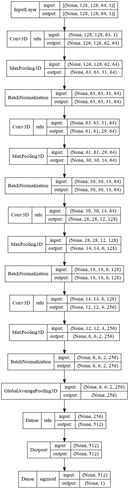
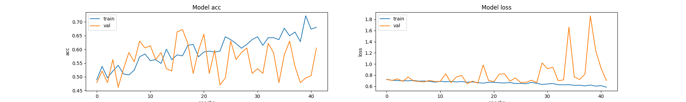
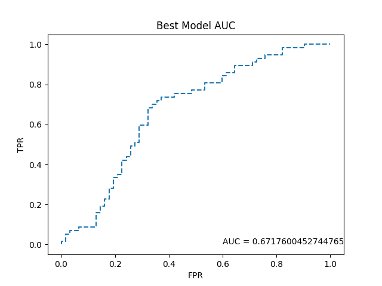

# Predicting AF outcomes using 3D deep learning of CT scans

## Dataset Building
### DICOM to NifTI
The input scans are in the DICOM format, and are converted to NifTI images using `dicom2nii.py`. A single DICOM file can contain multiple image slices or volumes within it, each representing different aspects or sequences of medical imaging data. When converting a DICOM file to NIfTI, each of these slices or volumes is extracted and saved as separate NIfTI images. Console output is stored in `data/log/dicom2nii.out`.

### Best NifTI Selection
The best NifTI image is defined as the image with the best spacing. `bestnifti.py` selects this image based on a lookup table of previously generated images (`data/vandyniftibest.csv`). Console output is stored in `data/log/bestnifti.out`.

### Preprocessing
`preprocess.py` reads in the best NifTI images, normalizes it, and resizes them to a consistent size. The processed NifTI images are test-train split based on a clinical outcome (defined in `data/vanderbilt_ct_phenotype_2-14-23.csv`) and are saved to `data.pkl`. 

## Modeling
`model.py` trains a model from `data.pkl` and saves the best model (measured by validation accuracy) to `best_classifier.h5`. The model architecture is defined here:

Training was stopped when there was no improvement in validation accuracy over 25 epochs, or at the 100th epoch, whichever came first. Loss and accuracy over time is plotted:

### Model Performance
`performance.py` create a ROC curve of the best classifier (chosen in `model.py`). The performance of the best model is plotted below:

